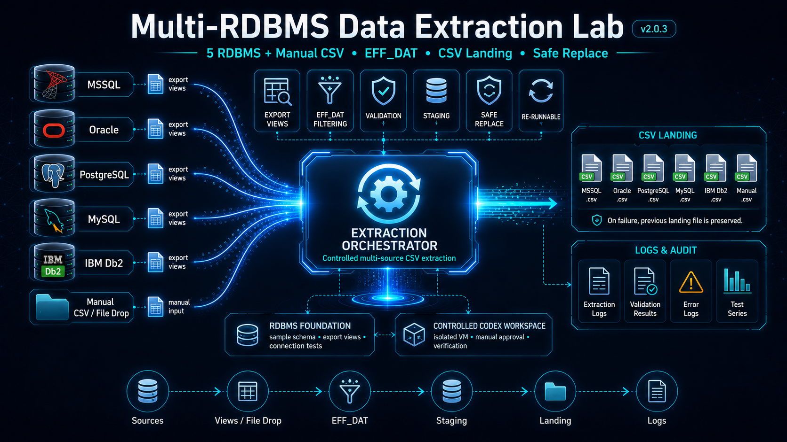

# Multi-RDBMS Data Extraction Lab



This repository presents a multi-source data extraction portfolio lab. The goal is to model a realistic Data Engineering scenario: extracting daily order data from several different source systems based on an `EFF_DAT` processing date, then producing per-source CSV landing files with a safe staging → landing replacement process.

The project uses five relational database sources exposed through controlled export views. A sixth source represents a manual / legacy CSV file-drop input.

> This English README is a concise project overview for international readers. The detailed project documentation is primarily written in Hungarian in the `docs/` folder.

## What this project demonstrates

This project is more than a connection demo. It demonstrates a controlled extraction workflow with:

- multiple RDBMS sources handled in a consistent way;
- read-only export views instead of direct base-table access;
- a manually controlled `EFF_DAT` processing date;
- per-source CSV landing outputs;
- staging → landing safe replacement;
- rerunnable extraction for the same `EFF_DAT`;
- preservation of previous landing files when a source fails;
- source-level failure isolation;
- documented logs, screenshots and sample outputs.

The focus of the repository is **system design, extraction logic, validation, failure handling and evidence-based documentation**.

## Project status

Current project status: **v2.0.3 – final documentation audit and end-to-end extraction checkpoint**.

The v2.0 checkpoint proved the working end-to-end extraction flow. The v2.0.3 state is the cleaned, documented and reviewed version prepared for publication. The working Python / PowerShell logic is unchanged; the documentation and repository structure have been finalized.

The project demonstrates:

- manual CSV / file-drop validation and landing CSV generation;
- connection and export-view SELECT checks against five RDBMS sources;
- actual CSV extraction from five database sources;
- controlled multi-day test runs between `2026-06-16` and `2026-06-20`;
- rerunning the same `EFF_DAT` and safely replacing successful outputs;
- failure simulation with an invalid MySQL port;
- preserving an existing landing file when the corresponding source fails;
- continuing successful sources even when one source fails;
- detailed logs, screenshots and evidence files.

Final full extraction test-series result: **PASS**.


The repository package was also tested from a freshly extracted folder using a local `.env` file and a separately copied Db2 JDBC driver. The smoke test confirmed that the project can be restarted outside the original development workspace.

## Source systems

| Source                 | Access / processing method                             | v2.0 status         |
| ---------------------- | ------------------------------------------------------ | ------------------- |
| MSSQL / SQL Server     | `pymssql`                                              | `SUCCESS_WITH_ROWS` |
| Oracle                 | `oracledb`                                             | `SUCCESS_WITH_ROWS` |
| IBM Db2                | JDBC via `JayDeBeApi` / `JPype1` / local `db2jcc4.jar` | `SUCCESS_WITH_ROWS` |
| MySQL                  | `mysql-connector-python`                               | `SUCCESS_WITH_ROWS` |
| PostgreSQL             | `psycopg2`                                             | `SUCCESS_WITH_ROWS` |
| Manual CSV / file-drop | local file-drop input folder                           | `SUCCESS_WITH_ROWS` |

The database sources are accessed through read-only export views. The extraction process intentionally works against controlled export interfaces instead of directly reading base tables.

## Main workflow

`EFF_DAT` is the manually controlled processing date used by the lab.

```text
source systems
        ↓
controlled export views / manual file-drop CSV input
        ↓
EFF_DAT filtering
        ↓
staging CSV
        ↓
successful run replaces landing CSV
        ↓
logs and evidence
```

The staging → landing logic is intentionally defensive: an existing landing file for a source is only replaced if the new extraction for that source completes successfully. If a source fails, its previous landing file remains unchanged.

## Main scripts

Manual CSV / file-drop extraction:

```text
src/check_manual_csv_source.py
```

Database connection checker:

```text
src/check_database_connections.py
```

Database source extraction into CSV landing files:

```text
src/extract_database_sources.py
```

Manual CSV test series:

```text
tools/run_manual_csv_test_series.ps1
```

Full multi-day extraction test series:

```text
tools/run_full_extraction_test_series.ps1
```

On Windows, the machine's PowerShell execution policy may block direct execution of the test runner. In the test environment it was executed with:

```powershell
powershell -NoProfile -ExecutionPolicy Bypass -File .\tools\run_full_extraction_test_series.ps1
```

## Output structure

Runtime outputs are generated under:

```text
data/staging/{EFF_DAT}/
data/landing/{EFF_DAT}/
```

Database-source outputs use:

```text
data/staging/{EFF_DAT}/database_sources/
data/landing/{EFF_DAT}/database_sources/
```

Example landing files:

```text
data/landing/2026-06-16/manual_csv_orders_2026-06-16.csv
data/landing/2026-06-16/database_sources/mssql_orders_2026-06-16.csv
data/landing/2026-06-16/database_sources/oracle_orders_2026-06-16.csv
data/landing/2026-06-16/database_sources/db2_orders_2026-06-16.csv
data/landing/2026-06-16/database_sources/mysql_orders_2026-06-16.csv
data/landing/2026-06-16/database_sources/postgresql_orders_2026-06-16.csv
```

The `EFF_DAT` value appears both in the folder path and in the output filename. This makes reruns for older processing dates safer because they do not overwrite landing outputs for a different date.

In the public repository, runtime `data/landing/` and `data/staging/` folders are kept only with `.gitkeep` files. Tested sample outputs and proof artifacts are stored under `evidence/`.

## Proven behavior

The final test series covered the following `EFF_DAT` values:

```text
2026-06-16
2026-06-17
2026-06-18
2026-06-19
2026-06-20
```

For each date:

- manual CSV extraction: `SUCCESS_WITH_ROWS`;
- database extraction: exit code `0`;
- database landing files: `5/5`;
- result: `PASS`.

The test series also validated rerun and failure behavior:

- rerun for `2026-06-16`: `PASS`;
- MySQL failure simulation with an invalid port: `FAILED_PORT_UNREACHABLE`;
- MySQL output action: `LEFT_EXISTING_FILE_UNCHANGED`;
- the MySQL landing file remained unchanged based on hash / timestamp checks;
- the other database sources continued successfully;
- `config/.env` was restored at the end of the test.

## Evidence

Main evidence folders:

```text
evidence/manual-csv-test-series/
evidence/database-connection-tests/
evidence/database-extraction/
evidence/full-extraction-test-series/
```

Selected evidence logs:

```text
evidence/database-connection-tests/final-5db-success/database_connection_test_20260621_075511.log
evidence/database-extraction/logs/database_extraction_20260621_075557.log
evidence/full-extraction-test-series/logs/full_extraction_test_series_20260621_075529.log
```

Selected screenshots:

```text
images/09_database_connection_tests/06_all_five_database_sources_success.png
images/10_database_extraction/01_database_extraction_5db_success.png
images/11_full_extraction_test_series/01_full_extraction_test_series_pass.png
```

## Documentation

Detailed documentation files:

```text
docs/01_project_overview.md
docs/02_source_export_views.md
docs/03_readonly_export_access.md
docs/04_manual_csv_source.md
docs/05_codex_workspace_started.md
docs/06_eff_dat_extraction_logic.md
docs/07_manual_csv_test_series.md
docs/08_file_transfer_boundary_and_codex_smb_diagnostics.md
docs/09_database_connection_tests.md
docs/10_database_extraction.md
docs/11_full_extraction_test_series.md
```

## Local configuration and smoke test

The public repository does not include a real `config/.env` file. For local execution, copy the example file:

```powershell
copy .\config\.env.example .\config\.env
notepad .\config\.env
```

The example configuration contains standard default ports, but the host, database/service, user and password values must be adjusted to the local lab environment.

For IBM Db2, a local JDBC driver JAR is required under `local_drivers/db2/`. The JAR file is intentionally not included in the repository.

The shared `DB_USERNAME` / `DB_PASSWORD` variable names are a lab simplification. The permission model is still source-level read-only export access; a real environment would normally use per-source credentials and secret management.

A local smoke test can be run in this order:

```powershell
& "$env:LOCALAPPDATA\Programs\Python\Python312\python.exe" .\src\check_manual_csv_source.py
& "$env:LOCALAPPDATA\Programs\Python\Python312\python.exe" .\src\check_database_connections.py
& "$env:LOCALAPPDATA\Programs\Python\Python312\python.exe" .\src\extract_database_sources.py
powershell -NoProfile -ExecutionPolicy Bypass -File .\tools\run_full_extraction_test_series.ps1
```

## Db2 JDBC note

IBM Db2 worked through the JDBC path:

```text
JayDeBeApi + JPype1 + db2jcc4.jar
```

`db2jcc4.jar` is a local driver dependency and is not part of the public repository. The example configuration only shows the expected local path:

```env
DB2_JDBC_JAR=local_drivers/db2/db2jcc4.jar
DB2_JDBC_CLASS=com.ibm.db2.jcc.DB2Driver
```

The `local_drivers/` folder and `*.jar` files are ignored by `.gitignore`.

## Development approach

This project was built with an AI-assisted development workflow.

I designed and validated the system architecture, the export-view concept, the `EFF_DAT` processing model, the staging → landing safe replacement rule, the read-only export access model and the test scenarios.

Codex helped implement the Python and PowerShell scripts based on the specification, in a controlled approval-based workflow. The purpose of this repository is not to claim independent Python development expertise, but to demonstrate that a multi-source data extraction workflow can be specified, tested, validated and documented in a controlled way.

The behavior was validated with black-box and integration-style tests: actual CSV outputs, execution logs, reruns and failure paths were compared against expected results. The documentation and code also went through multiple AI-assisted review rounds, including ChatGPT-based review and external Claude review points.

## Scope and intentional limitations

This project is not intended to be a full production-grade orchestration platform. The following are intentionally out of scope for this version:

- Airflow or another scheduler;
- control-table driven orchestration;
- production-grade automatic backfill logic;
- server-to-server file transfer implementation;
- central monitoring platform;
- unit test suite;
- fully containerized lab environment.

Known future improvement areas:

- extracting shared logic from `check_database_connections.py` and `extract_database_sources.py` into a common module such as `src/db_sources.py`;
- using parameterized / bind-variable based `EFF_DAT` filtering more consistently;
- adding point-in-time history handling to the manual CSV customer snapshot logic;
- making staging handling more consistent between the database and manual CSV branches;
- making PowerShell Python path resolution more portable through `PYTHON_EXE` override plus `python` / `py` fallback;
- adding production-grade scheduling, monitoring and unit testing layers.

The purpose of v2.0.3 is to demonstrate a working, reproducible and documented extraction lab: multiple sources, `EFF_DAT` filtering, CSV landing, safe reruns, failure handling and evidence.
