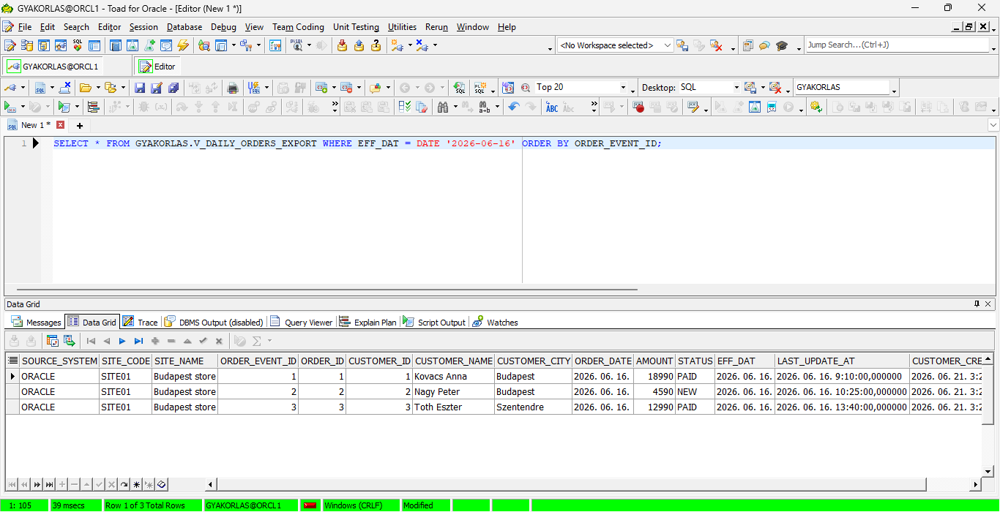
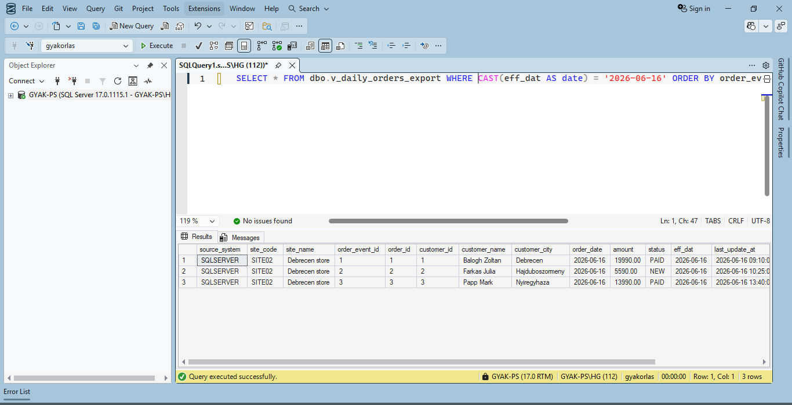
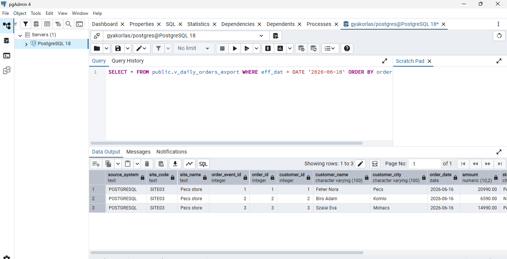
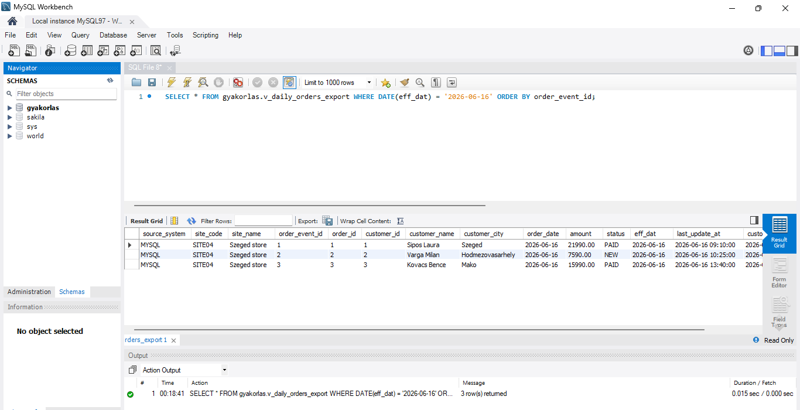
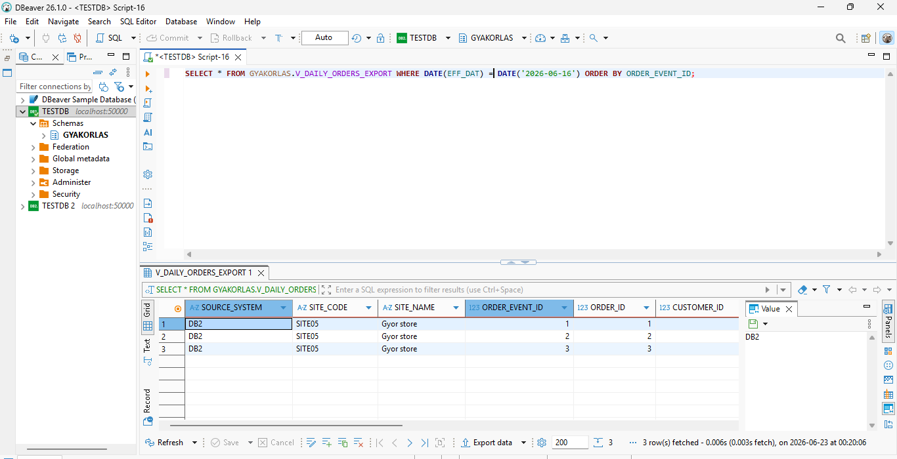

# Forrásoldali export nézetek

## Cél

Az adatbázisos források nem közvetlenül az alaptáblákon keresztül adnak adatot a kinyerő folyamatnak, hanem kontrollált export nézeteken keresztül.

Ez a megközelítés közelebb áll egy vállalati adatátadási modellhez, ahol a forrásrendszer egy stabil, jogosultságokkal korlátozott interfészt biztosít.

## Lehatárolás

Ez a dokumentum az öt adatbázisos forrás export nézeteit mutatja be. A manual CSV / file-drop forrás nem export view alapú adatbázisos interfész, ezért annak működése külön dokumentumban szerepel.

## Export nézet szerepe

Az export nézet feladata:

- elrejteni az alaptáblák belső szerkezetét;
- egységes üzleti adatképet adni a kinyerő folyamatnak;
- csak a szükséges oszlopokat publikálni;
- támogatni az `EFF_DAT` szerinti szűrést;
- egyszerűsíteni a read-only jogosultsági modellt.

Az export nézetek nem pusztán technikai SELECT-ek: a forrásoldali join logika, például az orders és customers adatok összekapcsolása, a nézet mögött történik. A kinyerő folyamat ezért már egy előkészített, üzleti szempontból értelmezhető export interfészt olvas.

## Logikai oszlopok

A projekt adatbázisos export nézetei a következő logikai mezőket adják át:

```text
source_system
site_code
site_name
order_event_id
order_id
customer_id
customer_name
customer_city
order_date
amount
status
eff_dat
last_update_at
customer_created_at
```

Az egyes adatbázis-driverek a lekérdezési metaadatokban eltérő kis- és nagybetűs oszlopneveket adhatnak vissza. A v2.0 kinyerési script szándékosan a cursor metadata szerinti oszlopneveket és oszlopsorrendet őrzi meg. Oracle és Db2 esetén emiatt a CSV fejléc nagybetűs lehet, míg más forrásoknál kisbetűs.

Későbbi fejlesztés lehet egy külön canonical output mapping réteg, amely minden forrásnál egységesített CSV fejléceket állít elő.

Megjegyzés: production környezetben külön kezelendő kérdés a forrásoldali sémaváltozás, például új oszlop megjelenése, oszlop átnevezése vagy adattípus változása. Későbbi verzióban érdemes lehet az export nézetek elvárt oszloplistáját és adattípusait külön schema contract vagy metadata leírás alapján ellenőrizni, majd eltérés esetén figyelmeztetést vagy kontrollált hibát adni.

## Nézetek forrásonként

| Forrás     | Export nézet                      |
| ---------- | --------------------------------- |
| MSSQL      | `dbo.v_daily_orders_export`       |
| Oracle     | `GYAKORLAS.V_DAILY_ORDERS_EXPORT` |
| PostgreSQL | `public.v_daily_orders_export`    |
| MySQL      | `gyakorlas.v_daily_orders_export` |
| IBM Db2    | `GYAKORLAS.V_DAILY_ORDERS_EXPORT` |

## EFF_DAT szűrés

A kinyerő oldali lekérdezések minden adatbázisnál az aktuális `EFF_DAT` értékre szűrnek.

Példa logikai feltétel:

```sql
WHERE eff_dat = DATE '2026-06-16'
```

Az egyes adatbázisokhoz a script a megfelelő szintaktikát használja. SQL Server esetén például `CAST(... AS date)`, Db2 esetén `DATE(...)` szerepel.

TODO: A későbbi verzióban a string-interpolált SQL összeállítás helyett driverenként bind változós / paraméterezett lekérdezést érdemes használni. A jelenlegi labban az `EFF_DAT` kontrollált konfigurációs értékből érkezik, de a bind változós megoldás szakmailag tisztább és biztonságosabb lenne.

## Ellenőrzött működés

A forrásoldali nézetek először kézi lekérdezésekkel kerültek ellenőrzésre, majd a connection checker mind az öt adatbázisos forrásnál sikeresen lekérdezte a nézeteket `EFF_DAT=2026-06-16` értékkel.

A v2.0 verzióban a nézetekből már tényleges CSV landing kinyerés is megtörtént több `EFF_DAT` napra:

```text
2026-06-16
2026-06-17
2026-06-18
2026-06-19
2026-06-20
```

## Képi bizonyítékok

A képek célja annak bizonyítása, hogy az adatbázisos forrásokban léteznek és kézzel lekérdezhetők a kontrollált export nézetek:










