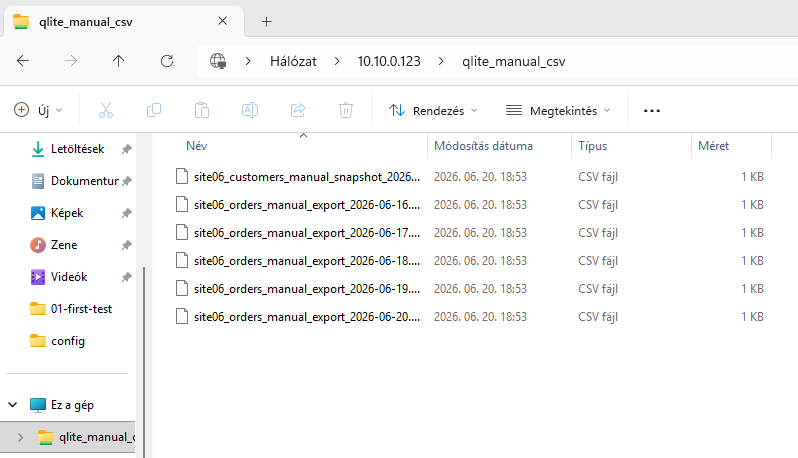
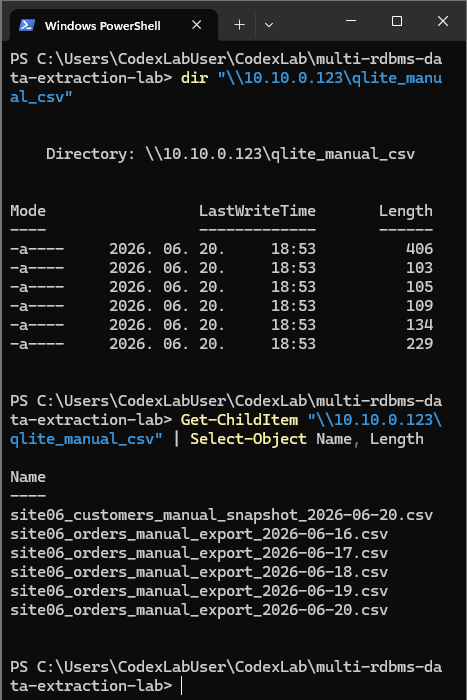

# Manual CSV forrás

## Cél

A manual CSV forrás azt modellezi, amikor egy kisebb, régebbi vagy félautomata telephelyi rendszer nem közvetlen adatbázis-kapcsolaton keresztül adja át az adatokat, hanem napi CSV exportokat biztosít.

A projektben ez a forrás a `SITE06` telephelyet szimulálja.

## Fájlátadási határvonal

A manual CSV kinyerő komponens **nem a forrásoldali szerverről a céloldalra történő fájlmozgatást valósítja meg**.

A feltételezés az, hogy egy külön, kontrollált fájlátadási folyamat gondoskodik arról, hogy a napi CSV-k a feldolgozó környezet input mappájába kerüljenek.

Ez a projektben így jelenik meg:

```text
forrásoldali rendszer / manual CSV export
        ↓
külön file transfer folyamat
        ↓
manual_csv_filedrop/
        ↓
manual CSV extraction script
        ↓
data/staging/{EFF_DAT}/
        ↓
data/landing/{EFF_DAT}/
```

## Forrásmappák

A working input mappa:

```text
manual_csv_filedrop/
```

Ez az a mappa, amelyből a kinyerő script dolgozik.

A védett baseline mappa:

```text
manual_csv_filedrop_baseline/
```

A tesztsorozat előtt és az egyes tesztesetek között a working input mappa ebből állítható vissza.

## Orders fájlok oszlopai

A napi orders CSV-k a státuszváltozások kezeléséhez az alábbi mezőket tartalmazzák:

```text
order_id
customer_id
order_date
amount
status
eff_dat
last_update_at
```

A mezők szerepe:

- `order_date`: a rendelés eredeti napja;
- `eff_dat`: az adott napi export / feldolgozási nap;
- `last_update_at`: a forrásoldali utolsó módosítás időpontja;
- `status`: a rendelés adott exportban ismert állapota.

Így egy korábbi rendelés későbbi napi exportban is megjelenhet, ha például a státusza `NEW` állapotról `PAID`, majd `SHIPPED` állapotra változik.

## Customer referenciaállomány

A manual CSV ág külön customer CSV-t is használ, amely a rendelési sorokhoz kapcsolódó ügyféladatokat biztosítja.

A customer CSV jelenlegi logikai mezői:

```text
customer_id
customer_name
city
created_at
```

A `created_at` mező ebben a labban technikai létrehozási / mintadat-generálási időpontként szerepel, nem üzleti érvényességi dátumként.

## Customer referenciaállomány és point-in-time megjegyzés

A manual CSV ágban a customer CSV ebben a verzióban bővülő referenciaállományként működik, nem point-in-time historizált customer dimensionként.

Ez azt jelenti, hogy a customer állomány az ismert ügyfelek körét bővíti, a tényleges kinyerés alapját viszont az adott `EFF_DAT` napra vonatkozó orders fájl adja. Olyan customer rekord önmagában nem kerül be a landing outputba, amelyhez az adott napi orders fájlban nincs kapcsolódó rendelési sor.

TODO: A customer CSV későbbi verzióban tartalmazzon `CUSTOMER_VALID_FROM` mezőt, és a manual CSV kinyerés csak azokat a customer rekordokat használja, amelyek az adott `EFF_DAT` napig már érvényesek voltak.

## Konfiguráció

A publikus mintakonfiguráció lokális file-drop mappát használ:

```env
EFF_DAT=2026-06-16
MANUAL_CSV_SOURCE_DIR=manual_csv_filedrop
CUSTOMERS_SNAPSHOT_FILE_PATTERN=site06_customers_manual_snapshot_*.csv
MANUAL_ORDERS_FILE_PATTERN=site06_orders_manual_export_{eff_dat}.csv
```

A tényleges `.env` fájl nem kerül publikálásra.

## UNC és Codex diagnosztika

A labor során a manual CSV forrás először UNC megosztáson keresztül volt elérhető:

```text
\\10.10.0.123\qlite_manual_csv
```

Kézi PowerShellből a megosztás elérhető volt, de a Codex sessionből végzett diagnosztika hozzáférési hibát mutatott. Ezért a projekt végül úgy kezeli a fájlmozgatást, mint külön rendszer felelősségét.

A döntés részletesen itt található:

```text
docs/08_file_transfer_boundary_and_codex_smb_diagnostics.md
```

## Kapcsolódó képek

A kézi PowerShell ellenőrzés során a manual CSV megosztás listázható volt.





## v2.0 ellenőrzött állapot

A v2.0 teljes tesztsorozatban a manual CSV ág öt egymást követő `EFF_DAT` értékre is sikeresen lefutott:

```text
2026-06-16
2026-06-17
2026-06-18
2026-06-19
2026-06-20
```

Minden futás `SUCCESS_WITH_ROWS` státusszal zárult.

A teljes tesztsorozat logja és a mintakimenetek a későbbi evidence commitban szerepelnek:

```text
evidence/full-extraction-test-series/logs/
evidence/full-extraction-test-series/sample-landing-outputs/
```
