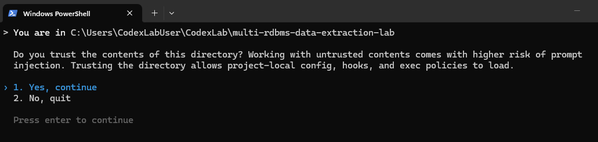
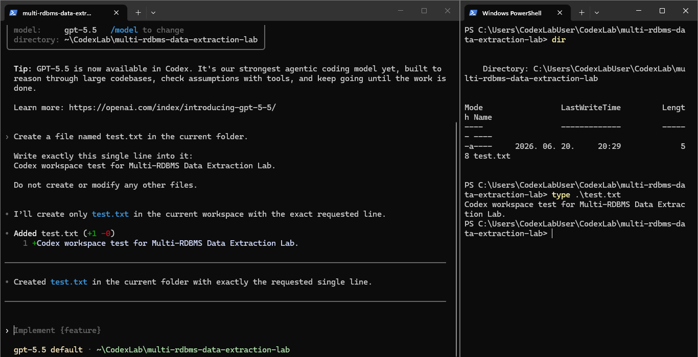
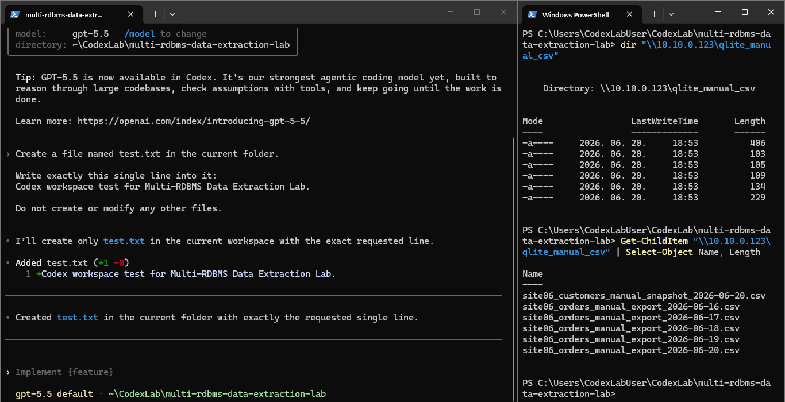
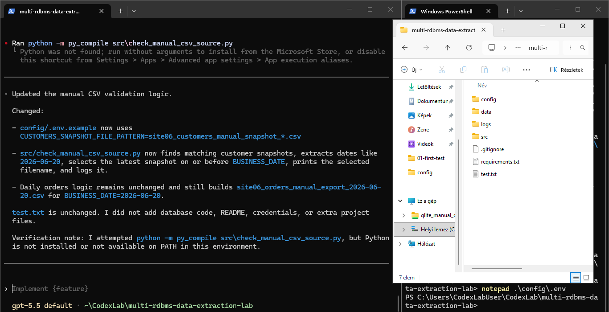

# Codex munkakörnyezet indítása

## Cél

A Codex ebben a projektben kontrollált technikai kivitelező szerepet kapott.

Nem a Codex tervezte meg önállóan a repót vagy az adatkinyerési architektúrát. A feladata az volt, hogy előre meghatározott, ember által jóváhagyott technikai részfeladatokat hajtson végre egy elkülönített tesztkörnyezetben.

A projekt szempontjából a Codex szerepe:

- kódgenerálás és kódmódosítás;
- diagnosztikai parancsok futtatása;
- hibák értelmezésének támogatása;
- kontrollált lokális tesztfuttatások előkészítése és végrehajtása.

## Felhasználói környezet

A munkavégzés külön Windows felhasználóval történt:

```text
CodexLabUser
```

Ez a megközelítés illeszkedik a korábbi Codex laborhoz: a Codex CLI külön standard felhasználói profilban, elkülönített munkamappában futott.

A cél az volt, hogy az AI-assisted fejlesztési környezet elkülönüljön a normál felhasználói és adminisztratív környezettől.

## Projektmappa

A jelenlegi projektmappa:

```text
C:\Users\CodexLabUser\CodexLab\multi-rdbms-data-extraction-lab
```

Ez egy lokális labútvonal. A projekt nem tartalmaz valós credentialt, production elérési adatot vagy gépspecifikus secretet.

## Első kontrollált teszt

A Codex először egy minimális fájllétrehozási tesztet kapott.

Feladat:

```text
Hozz létre egy test.txt nevű fájlt az aktuális mappában.

Pontosan ezt az egy sort írd bele:
Codex workspace test for Multi-RDBMS Data Extraction Lab.

Ne hozz létre és ne módosíts más fájlt.
```

Ezzel ellenőriztük, hogy:

- a Codex elindul a projektmappában;
- a munkakönyvtár helyes;
- a Codex tud fájlt létrehozni;
- a működés a `CodexLabUser` környezetben történik;
- a feladat hatóköre kontrollált marad.

Ez a `test.txt` csak átmeneti workspace tesztfájl volt, nem része a végleges repónak.

## Manual CSV validációs lépés

A következő Codex-feladat a manual CSV forrás ellenőrző scriptjének elkészítése volt.

A cél ekkor még nem az adatbázis-kapcsolatok tesztelése volt, hanem csak a manual CSV forrás programozott validálása:

- elérhető-e az input mappa;
- megtalálhatók-e a CSV fájlok;
- kiválasztható-e a customer snapshot;
- beolvasható-e a napi orders fájl;
- érvényesek-e a customer hivatkozások;
- készül-e futási log.

Ez a lépés később alapot adott az `EFF_DAT` alapú manual CSV kinyeréshez és a staging → landing safe replace logika kialakításához.

## Python környezet

Az első Codex-próbálkozás után kiderült, hogy a `CodexLabUser` környezetben a Python még nem volt elérhető.

Ezután a Python környezet telepítése megtörtént, majd a validációs script PowerShellből sikeresen lefutott.

Fontos megkülönböztetés:

- a scriptet a Codex-munkakörnyezetben készítettük elő;
- az első sikeres futtatást kézzel, PowerShellből végeztük;
- később a Codex is futtatta a local file-drop mappára átállított, `EFF_DAT` alapú manual CSV tesztsorozatot.

## Futtatási határvonal

A Codex ebben a projektben fejlesztési és technikai segédeszközként szerepel: kódot készít, módosít, diagnosztikát futtat és segít a hibák értelmezésében.

A valós SMB megosztásos manual CSV hozzáférést a `CodexLabUser` környezetből, kézi PowerShell futtatással validáltuk.

A Codex sessionből végzett SMB diagnosztika szerint a `10.10.0.123:445` port elérhető volt, de az UNC megosztás listázása hozzáférési hibára futott.

A későbbi Codex-futtatásokhoz ezért a fájlok workspace-en belüli lokális input mappába másolhatók, mintha egy külön fájlátadási folyamat már elvégezte volna a szerverek közötti állománymozgatást.

Ez illeszkedik a projekt általános file transfer határvonalához: a manual CSV extractor nem hálózati állománymozgató komponens, hanem a már átadott input fájlok feldolgozója.

A részletes SMB / file transfer döntés külön dokumentumban szerepel:

```text
docs/08_file_transfer_boundary_and_codex_smb_diagnostics.md
```

## Képernyőképek

Codex munkamappa megbízhatósági megerősítése:



Codex tesztfájl létrehozása:



Codex munkamappa és manual CSV megosztás ellenőrzése:



Manual CSV validációs lépés előkészítése:



## Összegzés

A Codex a projektben nem önálló döntéshozóként, hanem kontrollált AI-assisted development eszközként jelent meg.

A projektterv, a forrásrendszer-logika, az `EFF_DAT` alapú futtatási modell, a safe replace elv és a tesztforgatókönyvek emberi tervezés és jóváhagyás alapján készültek. A Codex ezek megvalósításában, ellenőrzésében és hibakeresésében segített.
