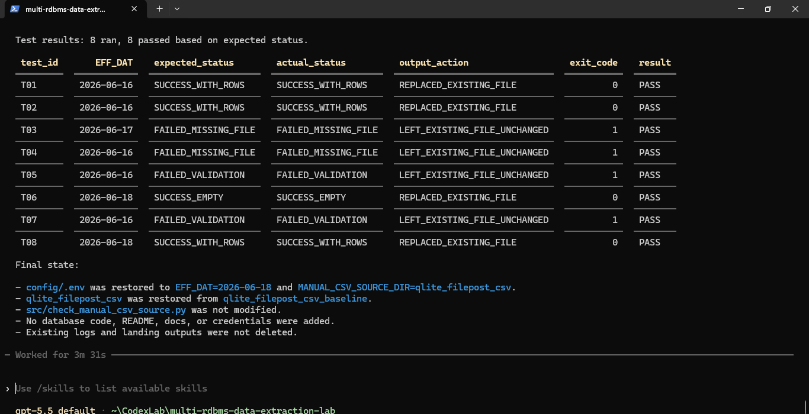
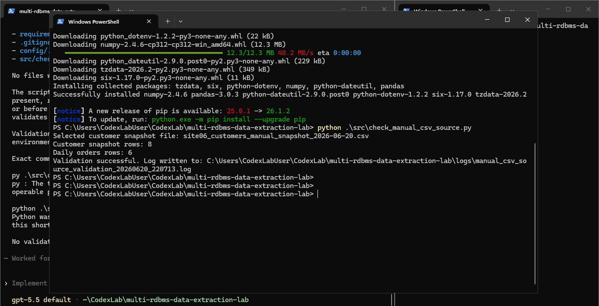
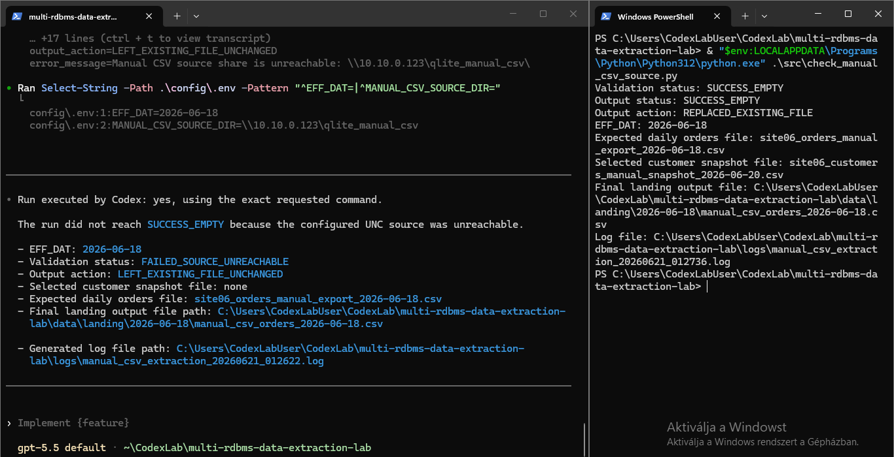

# Manual CSV tesztsorozat

## Cél

A manual CSV ág lezáró tesztje egy kontrollált, Codex által futtatott tesztsorozat volt.

A teszt célja az volt, hogy a local file-drop mappára átállított kinyerő ág több sikeres és hibás esetben is ellenőrizhető legyen.

A teszt tudatosan nem teljes scheduler vagy retry-framework bizonyítása, hanem a kinyerő komponens alapvető viselkedésének ellenőrzése:

- `EFF_DAT` alapú fájlválasztás;
- státuszváltozások kezeléséhez szükséges mezők átvétele;
- staging → landing biztonságos csere;
- újrafuttathatóság;
- hiba esetén meglévő landing fájl érintetlenül hagyása;
- kontrollált forrásmanipulációk kezelése.

## Tesztkörnyezet

A tesztsorozat local file-drop mappával futott. A publikus repóban ennek neve:

```text
manual_csv_filedrop/
```

A baseline mappa:

```text
manual_csv_filedrop_baseline/
```

Megjegyzés: a lezáró futás eredeti logjaiban még a korábbi lokális munkamappanév látható:

```text
qlite_filepost_csv
qlite_filepost_csv_baseline
```

A publikus repóban ezek beszédesebb névre lettek rendezve. A szerepük ugyanaz: working input mappa és baseline visszaállítási mappa.

A tesztfuttató script:

```text
tools/run_manual_csv_test_series.ps1
```

A script minden teszteset előtt visszaállította a working input mappát a baseline-ból, majd elvégezte az adott teszthez szükséges forrásmanipulációt.

## Lezáró Codex tesztsorozat

A Codex által futtatott lezáró tesztsorozat eredménye:

```text
Test results: 8 ran, 8 passed based on expected status.
```



## Korábbi kézi validációs képek

A következő képek a lezáró Codex tesztsorozat előtti kézi PowerShell-validációkból származnak.





## Tesztesetek

| Teszt | EFF_DAT    | Elvárt státusz        | Tényleges státusz     | Output action                  | Eredmény |
| ----- | ----------:| --------------------- | --------------------- | ------------------------------ | -------- |
| T01   | 2026-06-16 | `SUCCESS_WITH_ROWS`   | `SUCCESS_WITH_ROWS`   | `REPLACED_EXISTING_FILE`       | PASS     |
| T02   | 2026-06-16 | `SUCCESS_WITH_ROWS`   | `SUCCESS_WITH_ROWS`   | `REPLACED_EXISTING_FILE`       | PASS     |
| T03   | 2026-06-17 | `FAILED_MISSING_FILE` | `FAILED_MISSING_FILE` | `LEFT_EXISTING_FILE_UNCHANGED` | PASS     |
| T04   | 2026-06-16 | `FAILED_MISSING_FILE` | `FAILED_MISSING_FILE` | `LEFT_EXISTING_FILE_UNCHANGED` | PASS     |
| T05   | 2026-06-16 | `FAILED_VALIDATION`   | `FAILED_VALIDATION`   | `LEFT_EXISTING_FILE_UNCHANGED` | PASS     |
| T06   | 2026-06-18 | `SUCCESS_EMPTY`       | `SUCCESS_EMPTY`       | `REPLACED_EXISTING_FILE`       | PASS     |
| T07   | 2026-06-16 | `FAILED_VALIDATION`   | `FAILED_VALIDATION`   | `LEFT_EXISTING_FILE_UNCHANGED` | PASS     |
| T08   | 2026-06-18 | `SUCCESS_WITH_ROWS`   | `SUCCESS_WITH_ROWS`   | `REPLACED_EXISTING_FILE`       | PASS     |

## Tesztesetek magyarázata

- **T01**: normál sikeres 2026-06-16 futás;
- **T02**: ugyanarra az EFF_DAT-re újrafuttatás bővített forrásfájllal;
- **T03**: hiányzó 2026-06-17 napi orders fájl;
- **T04**: hiányzó customer snapshot;
- **T05**: a customer snapshot fájldátuma korábbi, mint a feldolgozott orders fájl legnagyobb `order_date` értéke;
- **T06**: csak fejlécet tartalmazó 2026-06-18 orders fájl, `SUCCESS_EMPTY` eredménnyel;
- **T07**: hibás `order_date` jövőbeli dátummal;
- **T08**: nem aktuális EFF_DAT-hez tartozó fájl hiánya nem blokkolja az aktuális futást.

## Bizonyítékok

A teljes tesztsorozat fő logja:

```text
evidence/manual-csv-test-series/codex-local-filedrop-test-series/manual_csv_test_series_20260621_030249.log
```

Ez tartalmazza a T01–T08 tesztesetek teljes bontását, az elvárt és tényleges státuszokat, az exit code-okat, az output action értékeket és a PASS eredményeket.

A tesztsorozat során keletkezett kinyerési logok:

```text
evidence/manual-csv-test-series/codex-local-filedrop-test-series/extraction-logs/
```

Megjegyzés: a részletes, tesztesetenkénti eredmény elsődleges forrása a fő tesztsorozat-log. Az extraction logok támogató futási logok, amelyek a kinyerő script adott futásainak állapotát rögzítik.

A lezáró Codex tesztsorozat mintakimenetei:

```text
evidence/manual-csv-test-series/codex-local-filedrop-test-series/sample-landing-outputs/
```

A `SUCCESS_EMPTY` teszt header-only mintakimenete:

```text
evidence/manual-csv-test-series/codex-local-filedrop-test-series/sample-success-empty-output/
```

## Korábbi kézi validációk

A projektben korábban kézi PowerShell futtatásokkal is validáltuk a manual CSV ágat, beleértve az UNC megosztásos elérést és több hibás esetet.

Ezek a korábbi bizonyítékok továbbra is megmaradtak az evidence mappában:

```text
evidence/manual-csv-test-series/logs/
evidence/manual-csv-test-series/sample-landing-outputs/
evidence/manual-csv-test-series/sample-success-empty-output/
```

A manual CSV ág lezáró állapotát azonban a Codex által futtatott local file-drop tesztsorozat adja, amely külön almappában szerepel:

```text
evidence/manual-csv-test-series/codex-local-filedrop-test-series/
```

## Értékelés

A manual CSV kinyerő ág bizonyított komponensnek tekinthető, és a v2.0 teljes tesztsorozatban már az adatbázisos kinyerési ággal együtt is sikeresen lefutott.

A manual CSV ág részletesebb v2.0 validációját a teljes kinyerési tesztsorozat dokumentálja:

```text
docs/11_full_extraction_test_series.md
```