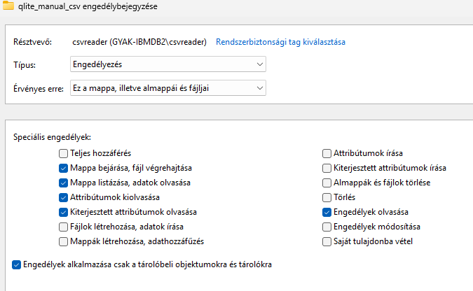
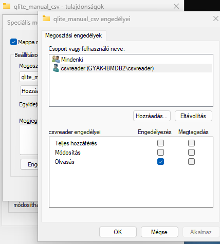
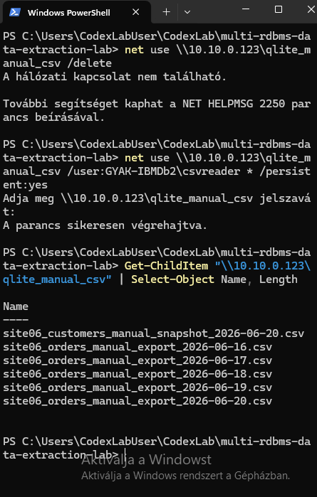
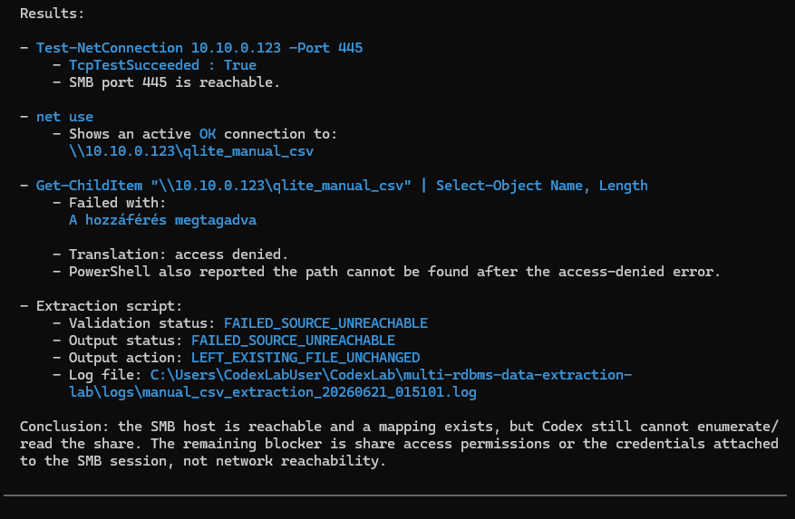

# Fájlátadási határvonal és Codex SMB diagnosztika

## Cél

A manual CSV forrás eredetileg SMB megosztáson keresztül volt elérhető a laborkörnyezetben.

A tesztek során külön ellenőrzésre került, hogy a Codex sessionből indított parancsok ugyanúgy elérik-e ezt a megosztást, mint a `CodexLabUser` környezetből indított kézi PowerShell futtatások.

A dokumentum célja annak bemutatása, hogy a projekt hol húzza meg a határt a fájlátadás és az adatkinyerés között.

## Megfigyelés

A kézi PowerShell futtatás a `CodexLabUser` környezetben sikeresen fel tudta csatolni és listázni tudta a megosztást.

Példa:

```text
\\10.10.0.123\qlite_manual_csv
```

A Codex session diagnosztikája alapján:

- a `10.10.0.123:445` SMB port elérhető volt;
- a `net use` aktív kapcsolatot mutatott;
- a megosztás listázása mégis hozzáférési hibára futott;
- a kinyerő script emiatt `FAILED_SOURCE_UNREACHABLE` státusszal állt meg;
- a meglévő landing kimenet nem íródott felül.

## Következtetés

Ez nem klasszikus hálózati routing vagy Hyper-V kapcsolati probléma volt, mert az SMB port elérhetőnek látszott.

A probléma a Codex session és az SMB megosztás hozzáférési rétege között jelentkezett. A projekt ezért különválasztja:

- a Codex által készített és módosított kódot;
- a PowerShellből validált valós UNC megosztásos hozzáférést;
- a Codex sessionből végzett hozzáférési diagnosztikát;
- a fájlátadási folyamatot, amely valós rendszerekben gyakran külön komponens.

## Dokumentációs döntés

A projektben a Codex szerepe kódgenerálás, kódmódosítás, diagnosztika és kontrollált lokális tesztfuttatás.

Az SMB megosztásos hozzáférést külön, kézi PowerShell futtatással validáltuk a `CodexLabUser` környezetben. A Codex sessionből végzett diagnosztika külön bizonyította, hogy a 445-ös port elérhető, de az UNC megosztás listázása hozzáférési hibára futott.

Ezért a manual CSV kinyerő komponens véglegesített működési modellje nem hálózati fájlmozgatásra épül, hanem céloldali input mappából dolgozik. A projekt a szerverek közötti fájlátadást külön rendszer vagy külön üzemeltetési folyamat felelősségének tekinti.

## Fájlátadási modell

A manual CSV ág véglegesített file-drop modellje:

```text
forrásoldali rendszer / manual CSV export
        ↓
külön fájlátadási folyamat
        ↓
céloldali input mappa
        ↓
EFF_DAT alapú kinyerő script
        ↓
staging CSV
        ↓
landing CSV
```

A publikus repóban a céloldali input mappát a következő local file-drop mappa modellezi:

```text
manual_csv_filedrop/
```

Ez nem azt jelenti, hogy valós környezetben ne lehetne SMB megosztást használni. Azt jelenti, hogy a jelen projekt elsődleges célja nem a szerverek közötti fájlmozgatás megvalósítása, hanem az `EFF_DAT` alapú kinyerési, validálási és landing logika bemutatása.

## Kapcsolódás a manual CSV ághoz

Ez a döntés összhangban van a manual CSV forrás dokumentációjával:

```text
docs/04_manual_csv_source.md
```

A manual CSV extractor a már átadott input fájlokat dolgozza fel. A fájlátadás, például SMB megosztás, ütemezett másolás vagy más file transfer megoldás, a kinyerő komponensen kívüli felelősség.

## Kapcsolódó képek

Az NTFS jogosultságoknál a `csvreader` felhasználó olvasási jellegű jogokat kapott a manual CSV mappára.



A megosztási jogosultságoknál a `csvreader` felhasználó olvasási hozzáférést kapott.



Kézi PowerShellből a `net use` csatlakozás és a megosztás listázása sikeres volt.



A Codex session diagnosztikája szerint a 445-ös port elérhető volt, de az UNC megosztás listázása hozzáférési hibára futott.


