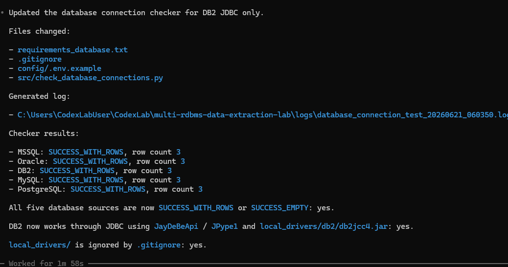
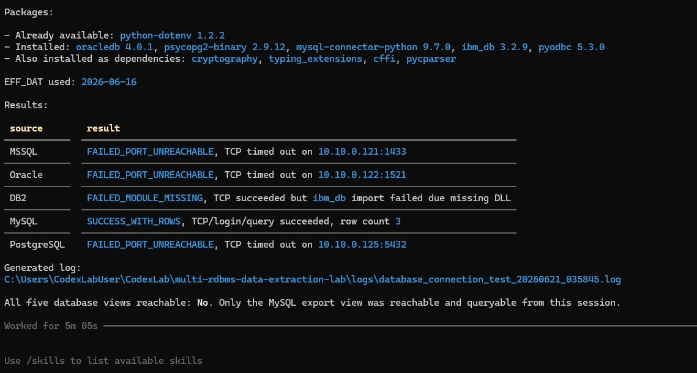
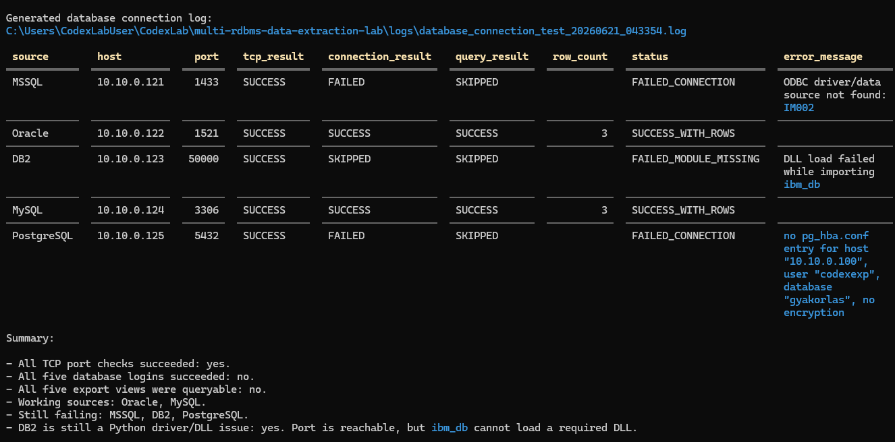
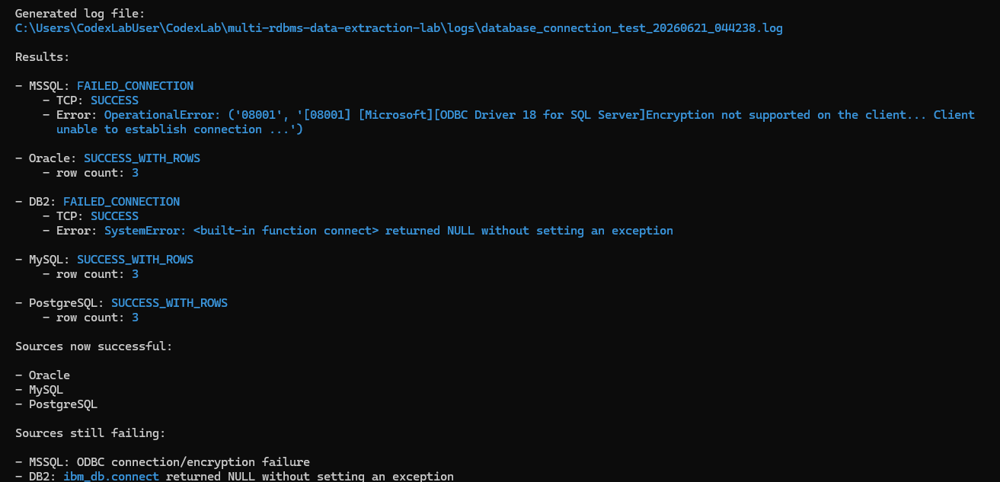
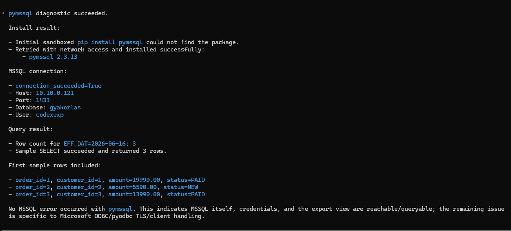
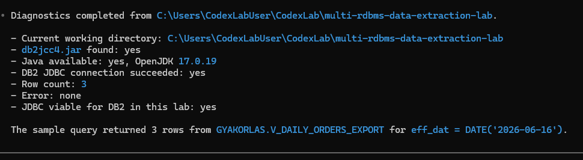

# Adatbázis-kapcsolati tesztek

Ez a dokumentum az öt adatbázisos forrás technikai kapcsolat- és nézetlekérdezési tesztjeit foglalja össze.

Ez a rész a **connection + export view SELECT checkpointot** rögzíti. A v2.0 állapotban erre a rétegre már ráépült a tényleges DB → CSV landing kinyerés is, amelyet külön dokumentum mutat be.

## v2.0 állapot röviden

A v2.0 checkpointban mind az öt adatbázisos forrás sikeresen kapcsolódott, és a `v_daily_orders_export` nézet `EFF_DAT=2026-06-16` szűréssel mindegyiknél 3 sort adott vissza.



| Forrás     | Host          | Port    | Adatbázis / service | Export nézet                      | Kapcsolódási mód              | v2.0 állapot        |
| ---------- | ------------- | -------:| ------------------- | --------------------------------- | ----------------------------- | ------------------- |
| MSSQL      | `10.10.0.121` | `1433`  | `gyakorlas`         | `dbo.v_daily_orders_export`       | `pymssql`                     | `SUCCESS_WITH_ROWS` |
| Oracle     | `10.10.0.122` | `1521`  | `ORCL1`             | `GYAKORLAS.V_DAILY_ORDERS_EXPORT` | `oracledb`                    | `SUCCESS_WITH_ROWS` |
| IBM Db2    | `10.10.0.123` | `50000` | `TESTDB`            | `GYAKORLAS.V_DAILY_ORDERS_EXPORT` | JDBC, `JayDeBeApi` / `JPype1` | `SUCCESS_WITH_ROWS` |
| MySQL      | `10.10.0.124` | `3306`  | `gyakorlas`         | `gyakorlas.v_daily_orders_export` | `mysql-connector-python`      | `SUCCESS_WITH_ROWS` |
| PostgreSQL | `10.10.0.125` | `5432`  | `gyakorlas`         | `public.v_daily_orders_export`    | `psycopg2`                    | `SUCCESS_WITH_ROWS` |

A lezáró 5/5 sikeres log:

```text
evidence/database-connection-tests/final-5db-success/database_connection_test_20260621_075511.log
```

## Connection checker

A kapcsolati teszt script:

```text
src/check_database_connections.py
```

A kiegészítő Python csomagok:

```text
requirements_database.txt
```

A script és a hozzá kapcsolódó Python függőségi fájl a repóban megtalálható a `src/` mappában, illetve a gyökérszintű `requirements_database.txt` fájlban.

Példa lokális futtatás Windows PowerShellből:

```powershell
python .\src\check_database_connections.py
```

A script forrásonként külön kezeli a hibákat. Egy sikertelen forrás nem állítja meg a teljes ellenőrzést, hanem a többi forrás tesztelése folytatódik.

## Ellenőrzött rétegek

A script minden adatbázisnál külön ellenőrzi:

1. TCP host/port elérés;
2. Python driver vagy modul betölthetősége;
3. adatbázis-login;
4. `v_daily_orders_export` nézet lekérdezése;
5. `EFF_DAT` szerinti sorszámlekérdezés;
6. kis minta `SELECT` futtatása.

## Diagnosztikai út röviden

A connection tesztek nem egyből indultak 5/5 sikerrel. Ez tudatosan bent marad a dokumentációban, mert jól mutatja a több RDBMS-es integráció gyakorlati hibakeresési rétegeit.

A képek és a válogatott logok diagnosztikai checkpointokat mutatnak. Nem minden köztes futás teljes logja kerül publikálásra, de a lényeges hibakeresési lépések és a végső 5/5 sikeres állapot bizonyított.

### 1. Első futás: csak MySQL működött teljesen

Az első körben a script és az `.env` alaplogika már működött, de több forrás még port-, driver- vagy konfigurációs hibán állt meg.



### 2. Portok és PostgreSQL `pg_hba.conf`

A tűzfalak és portelérések rendezése után több adatbázis már elérhetővé vált, de PostgreSQL-nél külön `pg_hba.conf` beállításra volt szükség a CodexLab gép IP-címéhez és a `codexexp` userhez.



### 3. Oracle, MySQL és PostgreSQL sikeres; MSSQL és IBM Db2 még függőben

A következő diagnosztikai checkpointban Oracle, MySQL és PostgreSQL már sikeresen lekérdezte az export nézetet. MSSQL-nél ODBC/TLS kliensoldali hiba maradt, IBM Db2-nél pedig a natív `ibm_db` út hibázott.



### 4. MSSQL: `pymssql` lett a működő út

Az MSSQL port elérhető volt, a jogosultsági modell rendben volt, de a Microsoft ODBC / `pyodbc` út kliensoldali TLS/security-package hibába futott. A külön `pymssql` diagnosztika igazolta, hogy az MSSQL adatbázis, a `codexexp` user és a view valójában lekérdezhető.



A projekt ezért az MSSQL kapcsolatnál a `pymssql` alapú megközelítést használja.

### 5. IBM Db2: JDBC lett a működő út

Az IBM Db2 Docker konténerben futó adatbázis portszinten elérhető volt a CodexLab gépről:

```text
10.10.0.123:50000
```

Az `ibm_db` csomag importálható volt, de a natív `ibm_db.connect` út kliensruntime jellegű hibára futott. A működő megoldás végül JDBC lett:

```text
JayDeBeApi + JPype1 + db2jcc4.jar
```



A `db2jcc4.jar` helyi driverfüggőség, ezért nem része a publikus repónak. A mintakonfiguráció csak a várt lokális útvonalat mutatja:

```env
DB2_JDBC_JAR=local_drivers/db2/db2jcc4.jar
DB2_JDBC_CLASS=com.ibm.db2.jcc.DB2Driver
```

A `local_drivers/` mappa nem kerül verziókezelésbe.

### 6. Végső 5/5 sikeres connection checkpoint

A végső futásban mind az öt adatbázisos forrás `SUCCESS_WITH_ROWS` státuszt adott. Ez a projekt v2.0 állapotában a DB connection + export view SELECT réteg lezárt checkpointja.


Megjegyzés: a képernyőképen látható, kódhoz és konfigurációhoz kapcsolódó fájlok (`src/`, `config/.env.example`, `requirements_database.txt`, `.gitignore`) a repóban külön fájlokként megtalálhatók. A tényleges lokális `config/.env` fájl továbbra sem része a publikus repónak.

## Fontosabb diagnosztikai tanulságok

A több RDBMS-es kapcsolatépítésnél több különböző hibatípus jelent meg:

- több adatbázisnál először tűzfal / port elérési probléma volt;
- PostgreSQL esetén a port elérése után `pg_hba.conf` beállítás kellett a `codexexp` user és a Codex gép IP-címe felé;
- MSSQL esetén a Microsoft ODBC / `pyodbc` út kliensoldali TLS/security-package hibába futott, de `pymssql` kapcsolattal a nézetlekérdezés sikeres lett;
- IBM Db2 esetén az `ibm_db` natív CLI/runtime út nem működött stabilan ebben a labkörnyezetben, viszont JDBC-vel a kapcsolat és a query sikeres lett.

## Mi nem kerül a repóba

A repó nem tartalmazza:

- valós jelszavakat;
- lokális `config/.env` fájlt;
- IBM Db2 JDBC driver JAR fájlt;
- teljes forrásoldali adatbázis-admin beállításokat;
- tűzfalszabályok részletes lépésenkénti naplóját;
- adatbázistábla-létrehozó vagy belső forrásoldali újraépítő scripteket.

A dokumentáció célja az adatkinyerő oldal kapcsolódási rétegének bemutatása, nem az adatbázisok teljes adminisztrációs telepítési leírása.

## Kapcsolat a v2.0 adatkinyeréssel

Ez a checkpoint volt a DB → CSV extraction előfeltétele. Miután mind az öt adatbázisos forrás sikeresen kapcsolódott és lekérdezte az export nézetet, elkészült a tényleges adatbázisos kinyerő script:

```text
src/extract_database_sources.py
```

A DB → CSV landing kinyerés részletei:

```text
docs/10_database_extraction.md
```

A teljes többnapos tesztsorozat részletei:

```text
docs/11_full_extraction_test_series.md
```
