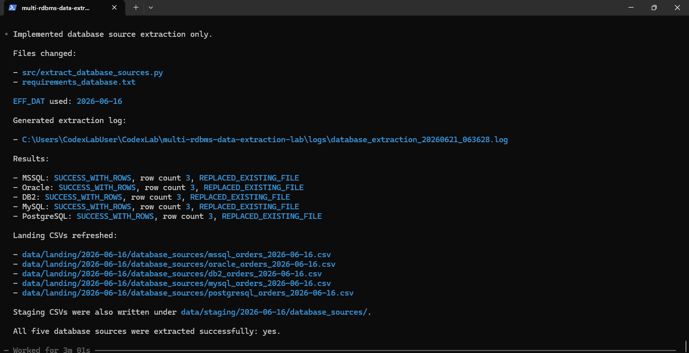

# Adatbázisos kinyerés

## Cél

Ez a dokumentum az öt adatbázisos forrásból történő tényleges CSV landing kinyerést foglalja össze.

A korábbi connection checker azt bizonyította, hogy az öt adatbázis elérhető, a read-only export user működik, és az export nézetek `EFF_DAT` szerint lekérdezhetők. A v2.0 állapotban erre épült rá az adatbázisos kinyerő script, amely forrásonként CSV állományokat készít.

Ez a rész az **egy adott `EFF_DAT` napra futtatott DB → CSV extraction checkpointot** mutatja be. A többnapos, manual CSV + 5 DB teljes tesztsorozat külön dokumentumban szerepel:

```text
docs/11_full_extraction_test_series.md
```

## Script

Az adatbázisos kinyerő script:

```text
src/extract_database_sources.py
```

Példa lokális futtatás Windows PowerShellből:

```powershell
python .\src\extract_database_sources.py
```

A kapcsolódó `src/` tartalom, a mintakonfiguráció és a függőségi fájlok a repóban külön fájlokként megtalálhatók. A tényleges lokális `config/.env` fájl és a Db2 JDBC driver JAR nem része a publikus repónak.

## Feldolgozott források

| Forrás     | Driver / kapcsolat            | Adatbázis / service | Séma        | Export nézet                      |
| ---------- | ----------------------------- | ------------------- | ----------- | --------------------------------- |
| MSSQL      | `pymssql`                     | `gyakorlas`         | `dbo`       | `dbo.v_daily_orders_export`       |
| Oracle     | `oracledb`                    | `ORCL1`             | `GYAKORLAS` | `GYAKORLAS.V_DAILY_ORDERS_EXPORT` |
| IBM Db2    | JDBC, `JayDeBeApi` / `JPype1` | `TESTDB`            | `GYAKORLAS` | `GYAKORLAS.V_DAILY_ORDERS_EXPORT` |
| MySQL      | `mysql-connector-python`      | `gyakorlas`         | `gyakorlas` | `gyakorlas.v_daily_orders_export` |
| PostgreSQL | `psycopg2`                    | `gyakorlas`         | `public`    | `public.v_daily_orders_export`    |

Megjegyzés: az egyes adatbázismotorok eltérően kezelik az adatbázis, séma és objektumnév fogalmát. SQL Server esetén a `gyakorlas` az adatbázis, azon belül a `dbo` a séma. PostgreSQL esetén a `gyakorlas` az adatbázis, a `public` a séma. Oracle és Db2 esetén a `GYAKORLAS` séma/user szinten jelenik meg, MySQL esetén pedig a `gyakorlas` adatbázis/séma névként szerepel. 

## Működési lépések

A script minden adatbázisos forrásra külön végrehajtja:

1. konfiguráció betöltése a `config/.env` fájlból;
2. TCP host/port ellenőrzés;
3. Python driver / modul rendelkezésre állásának ellenőrzése;
4. adatbázis-kapcsolódás;
5. export nézet lekérdezése az aktuális `EFF_DAT` értékre;
6. CSV írás staging mappába;
7. siker esetén landing fájl létrehozása vagy cseréje;
8. log írás;
9. konzolos összefoglaló megjelenítése.

A források egymástól függetlenül futnak. Egy adatbázis hibája nem akadályozza meg a többi adatbázis sikeres kinyerését.

## Kimeneti fájlok

Példa `EFF_DAT=2026-06-16` esetén:

```text
data/staging/2026-06-16/database_sources/mssql_orders_2026-06-16.csv
data/staging/2026-06-16/database_sources/oracle_orders_2026-06-16.csv
data/staging/2026-06-16/database_sources/db2_orders_2026-06-16.csv
data/staging/2026-06-16/database_sources/mysql_orders_2026-06-16.csv
data/staging/2026-06-16/database_sources/postgresql_orders_2026-06-16.csv

data/landing/2026-06-16/database_sources/mssql_orders_2026-06-16.csv
data/landing/2026-06-16/database_sources/oracle_orders_2026-06-16.csv
data/landing/2026-06-16/database_sources/db2_orders_2026-06-16.csv
data/landing/2026-06-16/database_sources/mysql_orders_2026-06-16.csv
data/landing/2026-06-16/database_sources/postgresql_orders_2026-06-16.csv
```

A runtime `data/` kimenetek nem kerülnek közvetlenül verziózásra. A többnapos teljes tesztsorozat válogatott mintakimenetei későbbi evidence commitban szerepelnek:

```text
evidence/full-extraction-test-series/sample-landing-outputs/
```

## Státuszok

A script által használt fő státuszok:

| Státusz                   | Jelentés                                                                         |
| ------------------------- | -------------------------------------------------------------------------------- |
| `SUCCESS_WITH_ROWS`       | A forrás elérhető volt, a lekérdezés sikeres, és sorokat adott vissza            |
| `SUCCESS_EMPTY`           | A lekérdezés sikeres volt, de nem adott vissza adat sort; fejléc-only CSV készül |
| `FAILED_PORT_UNREACHABLE` | A TCP host/port nem volt elérhető                                                |
| `FAILED_MODULE_MISSING`   | Hiányzik egy szükséges Python modul                                              |
| `FAILED_DRIVER_MISSING`   | Hiányzik például a Db2 JDBC driver JAR                                           |
| `FAILED_CONNECTION`       | A TCP elérés után az adatbázis-kapcsolódás hibára futott                         |
| `FAILED_QUERY`            | A kapcsolódás sikeres volt, de a lekérdezés hibára futott                        |
| `FAILED_OUTPUT_WRITE`     | A lekérdezés sikeres volt, de a CSV írás / landing csere hibára futott           |

Konfigurációs hiba esetén a script külön `FAILED_CONFIG` státuszt írhat a logba.

## Output action

| Output action                  | Jelentés                                             |
| ------------------------------ | ---------------------------------------------------- |
| `CREATED_NEW_FILE`             | Sikeres futás után új landing fájl készült           |
| `REPLACED_EXISTING_FILE`       | Sikeres futás után meglévő landing fájl cserélődött  |
| `LEFT_EXISTING_FILE_UNCHANGED` | Hiba esetén a korábbi landing fájl érintetlen maradt |
| `NO_OUTPUT_CREATED`            | Hiba történt, és nem volt korábbi landing fájl       |

## Sikeres 5 DB extraction futás és újrafuttatás

A kinyerő script sikeresen lefutott mind az öt adatbázisos forrásra:



A kiemelt smoke extraction futás:

```text
evidence/database-extraction/logs/database_extraction_20260621_075521.log
```

Ebben mind az öt forrás `SUCCESS_WITH_ROWS` státusszal zárult, az output action pedig `CREATED_NEW_FILE` volt, mert a landing fájlok a friss smoke test mappában még nem léteztek.

Az újrafuttatási / safe replace működést a következő log mutatja:

```text
evidence/database-extraction/logs/database_extraction_20260621_075557.log
```

Ebben mind az öt adatbázisos forrás `SUCCESS_WITH_ROWS` státusszal zárult, és a meglévő landing CSV-k `REPLACED_EXISTING_FILE` actionnel frissültek.

## Hibaág: MySQL port-hiba

A hibaágat a következő log mutatja:

```text
evidence/database-extraction/logs/database_extraction_20260621_075606.log
```

Ebben a MySQL forrás `FAILED_PORT_UNREACHABLE` státusszal zárult, miközben a másik négy adatbázisos forrás sikeresen lefutott. A MySQL landing fájl `LEFT_EXISTING_FILE_UNCHANGED` actionnel védve maradt.

Ez a futás bizonyítja, hogy a DB extractor forrásonként kezeli a hibákat, és részleges forráshiba esetén nem írja felül a korábbi sikeres landing kimenetet.

## Korábbi támogató futások

A mappában szerepelnek korábbi támogató logok is:

```text
evidence/database-extraction/logs/database_extraction_20260621_063628.log
evidence/database-extraction/logs/database_extraction_20260621_064417.log
evidence/database-extraction/logs/database_extraction_20260621_064547.log
```

Ezek a korábbi munkamappában végzett futások a sikeres kinyerés, újrafuttatás és MySQL hibaág előzetes ellenőrzését mutatják. A dokumentáció elsődlegesen a későbbi smoke extraction logokra hivatkozik.

Megjegyzés: a logokban látható lokális mappanevek, például `RepoSmokeTest` vagy `multi-rdbms-data-extraction-lab-v2.0.1`, a teszteléshez használt helyi munkamappák nevei. Ezek nem publikus release-verzióként értelmezendők.

## CSV fejléc és oszlopnév-megőrzés

A script a cursor / driver által visszaadott oszlopneveket és oszlopsorrendet írja ki a CSV-be.

Ez fontos technikai döntés, mert így pontosan látszik, mit adott vissza az adott forrás driver-szinten. Emiatt Oracle és Db2 esetén az oszlopnevek nagybetűsek lehetnek, míg más adatbázisoknál kisbetűsek.

Későbbi fejlesztési irány lehet egy külön output-normalizáló réteg, amely minden forrás CSV-jében egységes canonical fejlécet állít elő.

## Db2 JDBC sajátosság

A Db2 kapcsolat JDBC-n keresztül működik:

```text
JayDeBeApi
JPype1
local_drivers/db2/db2jcc4.jar
```

A `local_drivers/` mappa és a `*.jar` fájlok nem kerülnek a publikus repóba. A lokális driver útvonal a `config/.env.example` fájlban csak mintaként szerepel.
