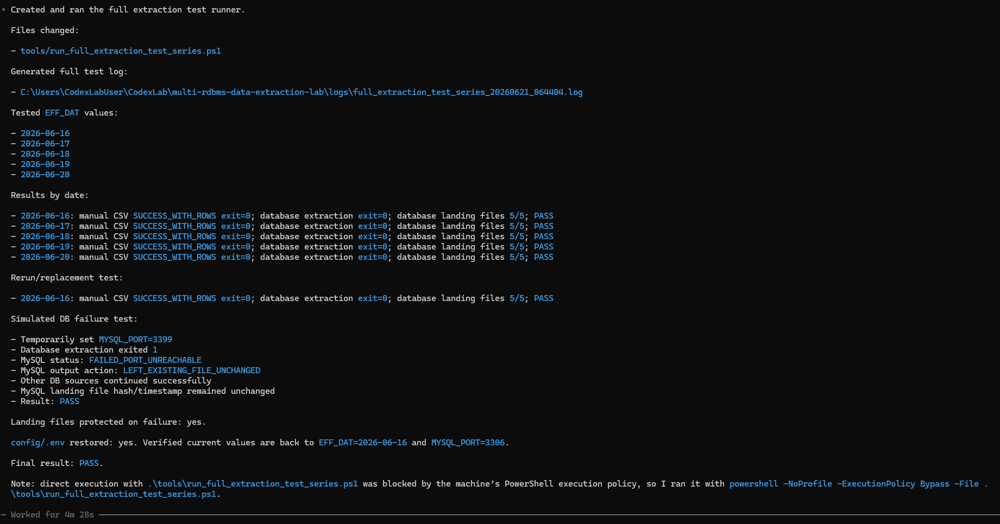

# Teljes kinyerési tesztsorozat

## Cél

A v2.0 lezáró tesztsorozat célja annak ellenőrzése volt, hogy a teljes kinyerési folyamat több napra, több forrásból, újrafuttatható és hibatűrő módon működik.

A tesztsorozat nem production scheduler. Kontrollált validációs harness, amely ideiglenesen módosítja az `EFF_DAT` értékét, lefuttatja a kinyerő scripteket, ellenőrzi a kimeneteket, majd visszaállítja az eredeti `config/.env` tartalmat.

## Tesztfuttató script

A teljes tesztsorozatot futtató PowerShell script:

```text
tools/run_full_extraction_test_series.ps1
```

A tesztfuttató script a repó `tools/` mappájában található. A teljes tesztsorozat dokumentációja, képi bizonyítéka, logjai és válogatott mintakimenetei az ehhez tartozó `docs/`, `images/` és `evidence/` mappákban szerepelnek.

A gép PowerShell execution policy beállítása miatt a futás kontrollált tesztkörnyezetben így történt:

```powershell
powershell -NoProfile -ExecutionPolicy Bypass -File .\tools\run_full_extraction_test_series.ps1
```

A tesztsorozat minden napra lefuttatta:

```text
src/check_manual_csv_source.py
src/extract_database_sources.py
```

A két Python script a repó `src/` mappájában található.

## Tesztelt napok

```text
2026-06-16
2026-06-17
2026-06-18
2026-06-19
2026-06-20
```

Ellenőrzött elemek:

- a manual CSV extraction futása;
- az öt adatbázisos forrás extraction futása;
- a landing mappa létrejötte;
- a staging mappa létrejötte;
- az öt adatbázisos landing CSV megléte;
- a CSV fájlok sorainak száma;
- a futási logok;
- az exit code értékek;
- a teszt végén a konfiguráció visszaállítása.

## Eredmény napokra bontva

| EFF_DAT      | Manual CSV          | Database extraction | DB landing files | Eredmény |
| ------------ | ------------------- | ------------------- | ---------------- | -------- |
| `2026-06-16` | `SUCCESS_WITH_ROWS` | exit `0`            | `5/5`            | PASS     |
| `2026-06-17` | `SUCCESS_WITH_ROWS` | exit `0`            | `5/5`            | PASS     |
| `2026-06-18` | `SUCCESS_WITH_ROWS` | exit `0`            | `5/5`            | PASS     |
| `2026-06-19` | `SUCCESS_WITH_ROWS` | exit `0`            | `5/5`            | PASS     |
| `2026-06-20` | `SUCCESS_WITH_ROWS` | exit `0`            | `5/5`            | PASS     |

A mintakimenetek sorai a lezáró loggal összhangban naponta eltérő mennyiséget tartalmaznak. Például `2026-06-20` napra a manual CSV output 10 sort, az adatbázisos források pedig forrásonként 8 sort tartalmaznak.

## Újrafuttatási teszt

A tesztsorozat újrafuttatta a `2026-06-16` napot.

Elvárt működés:

- sikeres forrásoknál a landing fájlok cserélődnek;
- a landing fájlok továbbra is léteznek;
- a row count értékek érvényesek maradnak.

Eredmény:

```text
2026-06-16: PASS
```

## Hibaszimuláció

A tesztsorozat kontrollált adatbázis-hibát is szimulált.

Módszer:

```text
MYSQL_PORT=3399
```

Ez csak ideiglenes `.env` módosítás volt. A teszt végén a konfiguráció visszaállt.

Elvárt működés:

- MySQL hibára fut;
- MySQL landing fájl érintetlen marad;
- a többi adatbázisos forrás tovább fut és sikeresen frissül;
- a database extraction script exit code-ja `1`, mert volt hibás forrás;
- a teljes teszteset akkor PASS, ha a hiba kontrolláltan és biztonságosan jelentkezik.

Tényleges eredmény:

```text
MySQL status: FAILED_PORT_UNREACHABLE
MySQL output action: LEFT_EXISTING_FILE_UNCHANGED
Other DB sources continued successfully
MySQL landing file hash/timestamp remained unchanged
Result: PASS
```

## Konfiguráció visszaállítása

A tesztharness a futás elején mentette a `config/.env` tartalmát, majd a végén visszaállította.

A lezáró log szerint:

```text
restored_config_env=True
final_status=PASS
```

A futás után ellenőrzött aktuális értékek:

```text
EFF_DAT=2026-06-16
MYSQL_PORT=3306
```

## Képi bizonyíték



## Logok

Fő tesztsorozat-log:

```text
evidence/full-extraction-test-series/logs/full_extraction_test_series_20260621_075529.log
```

Ez a log dokumentálja a lezáró, `PASS` eredményű futást.

A mappában szerepel egy korábbi sikeres full extraction futás is:

```text
evidence/full-extraction-test-series/logs/full_extraction_test_series_20260621_064404.log
```

Ez támogató bizonyíték, de a dokumentáció elsődleges hivatkozási alapja a későbbi `075529` log.

A tesztsorozat közben keletkezett reprezentatív manual CSV és database extraction logok:

```text
evidence/full-extraction-test-series/logs/manual/
evidence/full-extraction-test-series/logs/database/
```

## Külön repómappás smoke test

A csomag külön kicsomagolt repómappából is ellenőrzésre került lokális `config/.env` fájllal és külön bemásolt Db2 JDBC driverrel. Ez azt vizsgálta, hogy a projekt nem csak a fejlesztői munkamappában működik, hanem tiszta kicsomagolás után is újraindítható.

A lezáró full extraction logban látható `RepoSmokeTest` és `multi-rdbms-data-extraction-lab-v2.0.1` helyi mappanevek lokális tesztelési útvonalak. Ezek nem publikus release-verziót jelölnek.

A smoke test során a következő lépések futottak sikeresen:

```text
manual CSV extraction: SUCCESS_WITH_ROWS
database connection checker: 5/5 SUCCESS_WITH_ROWS
database extraction: 5/5 SUCCESS_WITH_ROWS
full extraction test series: final_status=PASS
restored_config_env=True
```

A repóban szereplő fő full extraction log a többnapos tesztharness lezáró, `PASS` eredményű futását dokumentálja:

```text
evidence/full-extraction-test-series/logs/full_extraction_test_series_20260621_075529.log
```

## Mintakimenetek

A tesztelt landing CSV-k válogatott mintái:

```text
evidence/full-extraction-test-series/sample-landing-outputs/
```

A mappa napokra bontva tartalmazza a manual CSV és az öt adatbázisos forrás landing CSV-it.

Minden naphoz tartozik:

- egy manual CSV landing kimenet;
- öt adatbázisos landing CSV kimenet a `database_sources/` mappában.

Megjegyzés: az egyes adatbázis-driverek dátum- és időbélyeg-formázása eltérhet. Például Oracle esetén az `EFF_DAT` a CSV-ben `YYYY-MM-DD 00:00:00` formában jelenhet meg, míg más forrásoknál egyszerű `YYYY-MM-DD` dátumként. Ez formátumbeli eltérés, nem üzleti dátumeltérés.

## Értelmezés

A v2.0 tesztsorozat azt igazolja, hogy a projekt nem egyszeri demóként működik, hanem kontrolláltan újrafuttatható és hiba esetén is adatvédő módon viselkedik.

Bizonyított működés:

- több `EFF_DAT` nap kezelése;
- manual CSV és database ág együtt;
- 5 RDBMS forrás sikeres kinyerése;
- staging → landing safe replace;
- újrafuttatás;
- részleges hiba kezelése;
- meglévő landing fájl megőrzése hibás forrásnál;
- `.env` visszaállítása teszt után.

Megjegyzés: Későbbi verzióban érdemes lehet futási manifest fájlt is előállítani, például `manifest.json` formában. Ez az adott `EFF_DAT` futás összesített jegyzőkönyve lehetne: forrásonkénti státusz, kinyert sorok száma, létrejött fájlok neve, futási időpont és opcionálisan a generált fájlok hash értéke. Ez a klasszikus DWH kontrolltáblás gondolkodás fájlalapú landing zónára alkalmazott megfelelője lenne.
